# 地址

github地址：https://github.com/haoyueb2/TodoMVC

网页地址：https://haoyueb2.github.io/TodoMVC/

（由于使用fontawesome可能导致第一次加载比较慢）

# 功能介绍

基本功能：

- 包含新增、删除、展现列表、全部完成/取消、删除已完成
- 保存页面状态，刷新页面后可恢复

全部实现

下面进行功能点的一一简单介绍：

## 新增

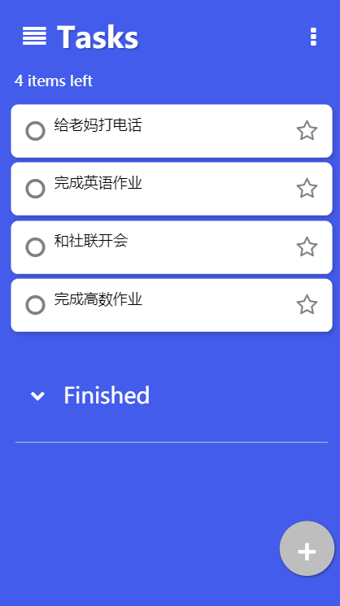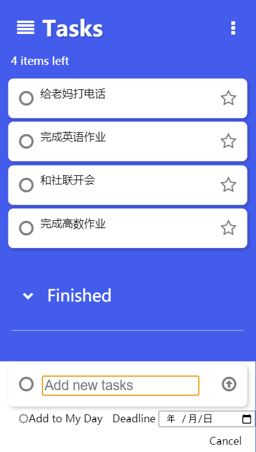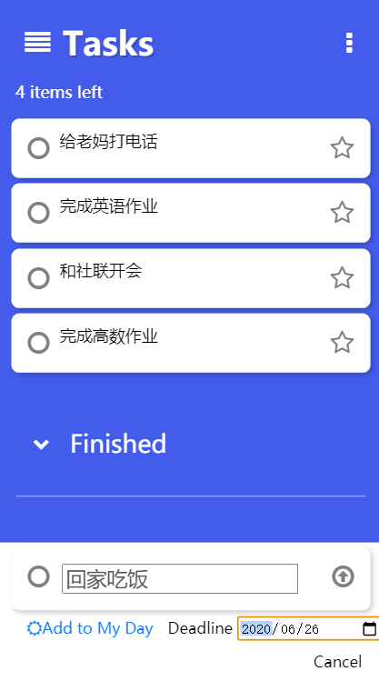

点击底部加号，弹出底部的新增框，对于手机端用户，会比将输入框放在上方更加方便。提交或者点击cancel则再次将底部输入框隐藏，将新建按钮展示。这里仿照了“Microsoft To Do”的设计，新建的任务可以加入“我的一天”，也可以设置截止日期，不添加默认为无。

## 展示列表

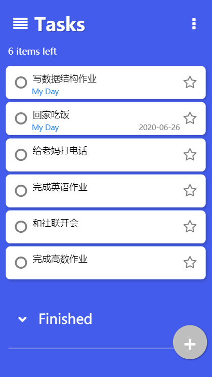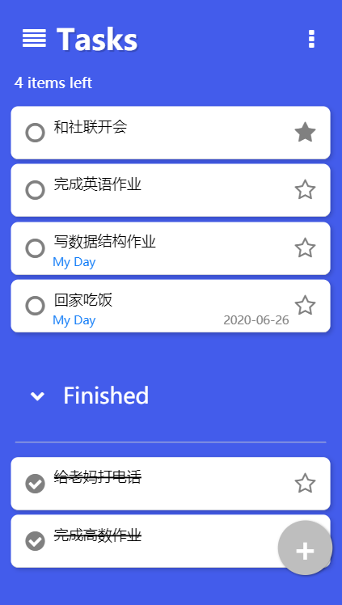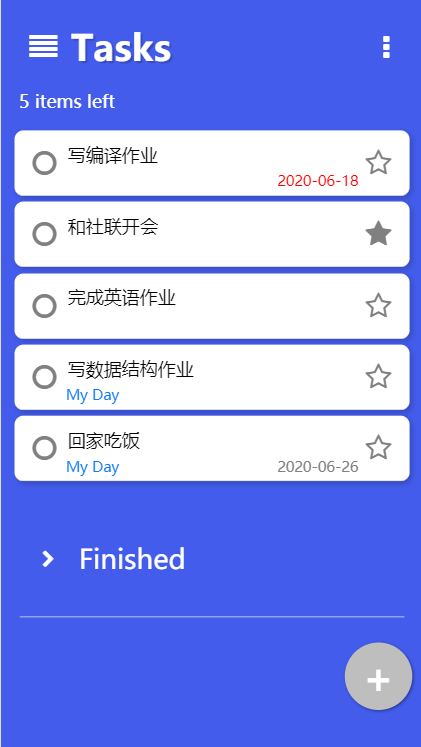

列表可以展示一个任务的全部信息：它是不是在“我的一天”计划内，它的截止日期，它是否已完成，它是不是重要的。“我的一天”用蓝色表示，截止日期在未来的话用灰色，如果几天已经过了截止日期，则将截止日期变为红色。

未完成和已完成的分两个列表显示，已完成的列表可以通过按钮控制其展示或者隐藏，展示时按钮箭头朝下，隐藏时箭头按钮朝右。点击下图中下拉菜单的Toggle Finished会显示/隐藏已完成列表，如上图的右图显示就是隐藏后的。

## 全部完成/取消、删除已完成

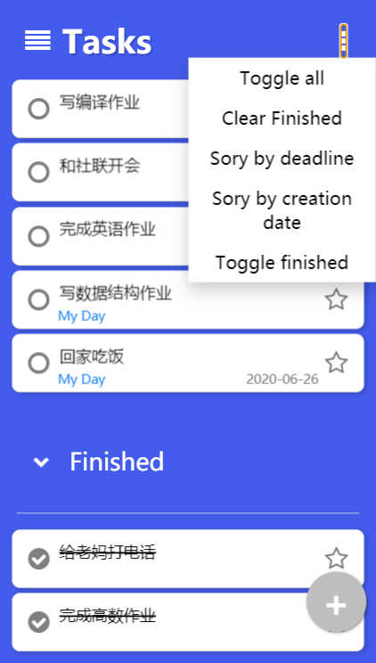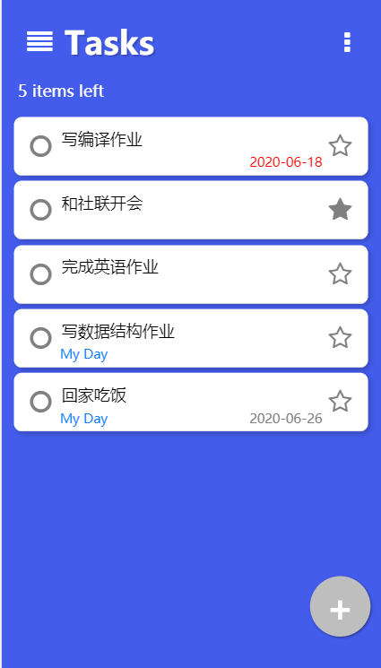

右上角的下拉菜单有全部完成/取消的按钮“Toggle all"，也有清除已完成按钮”Clear Finished“。

## 星标置顶

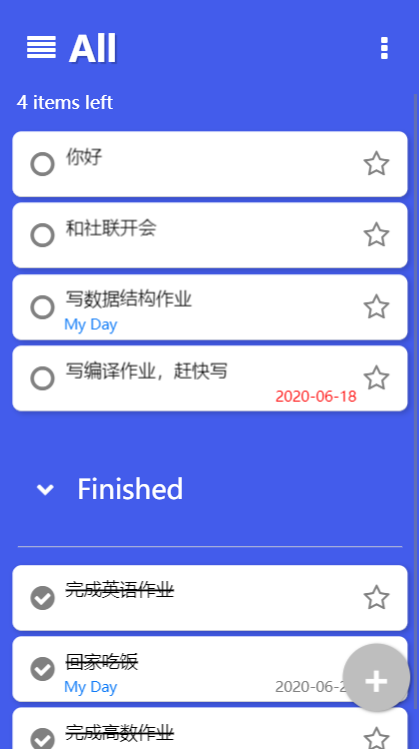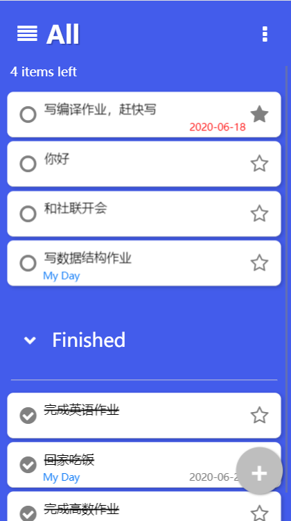

如图所示，将写编译作业右方的星号点击后，则会设其为重要任务，在本列表将其置顶，暂时将其优先度设置为最高。当然排序会改变这种优先度，星标不一定始终在最前。

实现方式是点击星号后，将该任务的priority设置为最高，然后调用update()，update()函数会始终将priority大的排在列表前方。

## 编辑

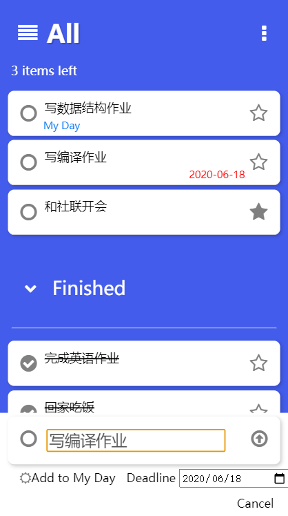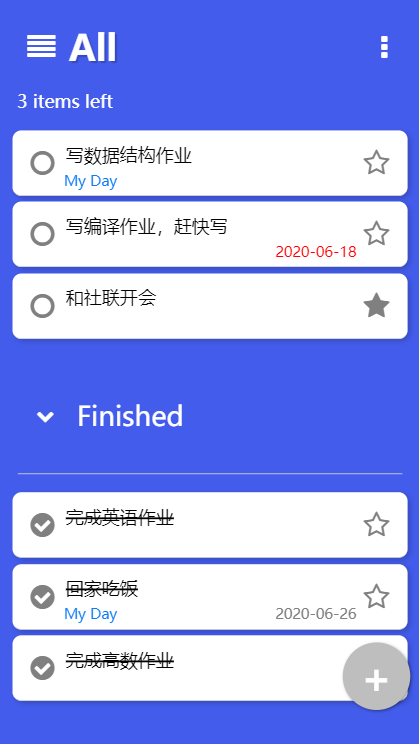

点击单条任务，会再次弹出底部的输入框，并会如图所示默认将该任务的信息填入，右图为我们编辑后的结果，在列表中的顺序也不会改变。

实现方式是和新建任务使用一样的函数，通过一个bool变量判断是新增还是编辑，以此来进行不同的操作。

## 排序

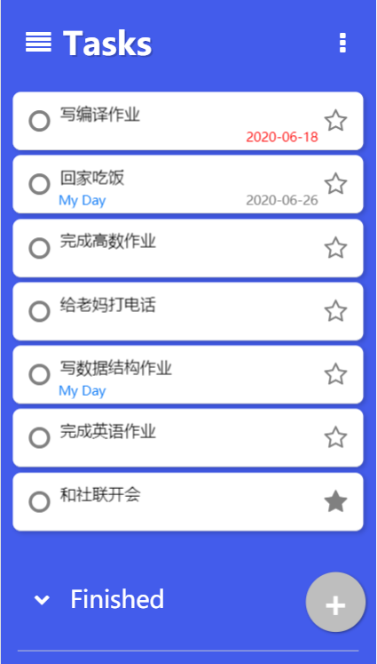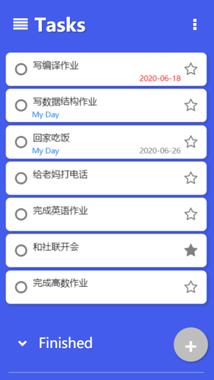

上图的下拉菜单中可以设置根据截止日期deadline排序，根据创建日期creation date排序，结果分别如上的左图和右图显示。根据截至日期排序时，有截止日期的排在没有的之前，截止日期早的排在前边。

实现方式为利用js的sort函数，自定义排序方式，然后逐个改变每个任务的priority，调用update即重新排序。

## 手势排序

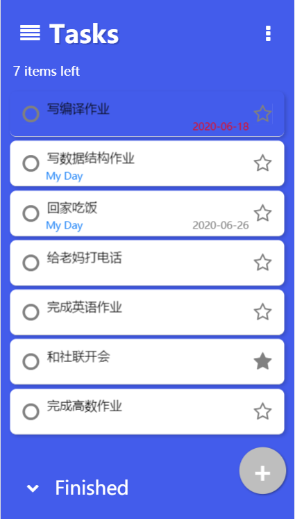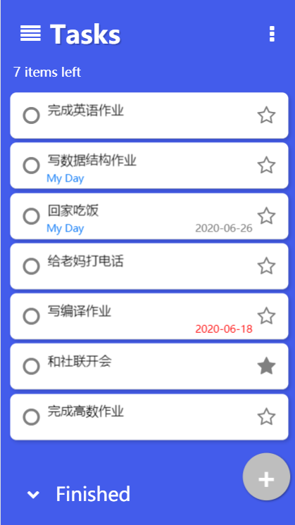

长按某一项700ms后，该任务项变为透明，这时可以进行移动排序，比如我们将该项拖至完成英语作业处，则两项的优先级对调，在列表中的顺序也会对调。

长按使用一个定时的的技巧，进入可排序状态后，在touchmove里时刻判断当前触摸的元素，然后再touchend里进行两个任务的priority的交换。

## 手势删除

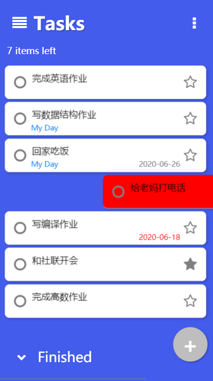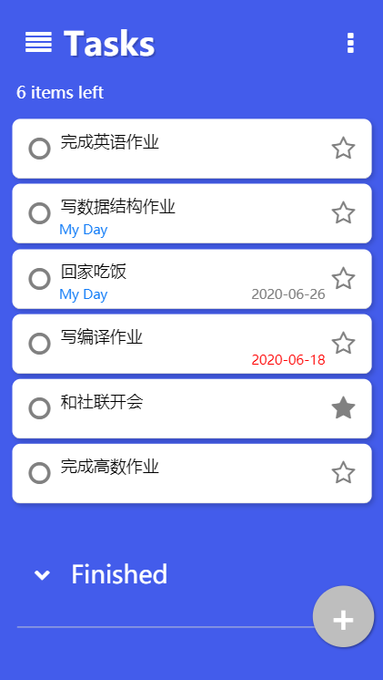

将某一项左滑或者右滑，滑动超过一定距离则该项背景色变为红色，这时松手即可将该项删除。

实现方式即判断手指水平移动的距离，到可删除状态就根据dom上的id获得model.data里的该任务，然后删除。

## 侧边栏

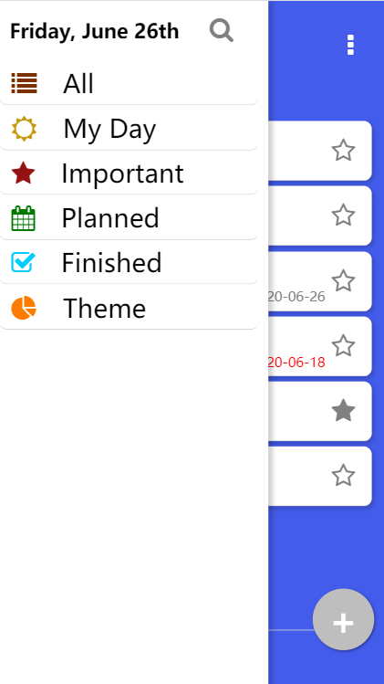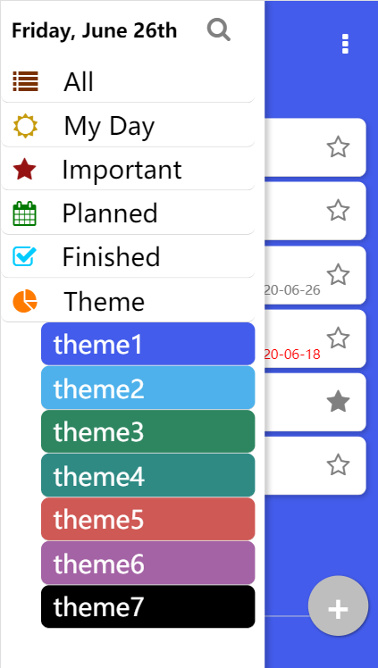

顶部标题为用js的Date()函数获取当前日期，侧边栏可以切换列表，进行搜索，选择主题等。

## 切换主题

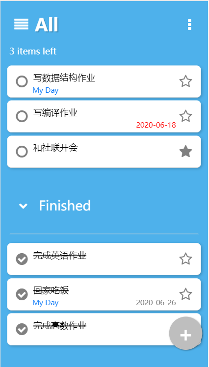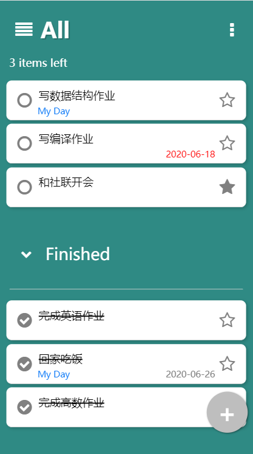

如侧边栏菜单展示，共有七种主题可选。

主题的颜色存在model.data里，所以也不会随着刷新改变。

## 不同列表

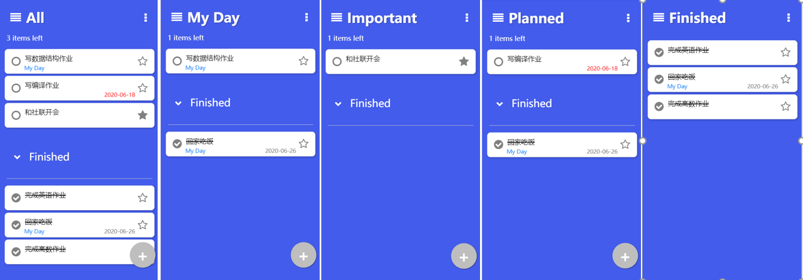

侧边栏可以切换列表，如上图所示，my day为在“我的一天"内的任务，important为重要任务，planned是已经设置deadline的，Finished是已完成的，在已完成列表我将新建按钮和剩余任务数统计都隐藏了。

在每一个列表新建任务，都会将该任务添加到该列表中。比如在My Day列表中，新建的任务会默认为在”我的一天“计划内，在Important列表中添加默认为重要的，在Planned列表中，如果不设置截止日期，则会默认将截止日期设置为今天。

## 搜索

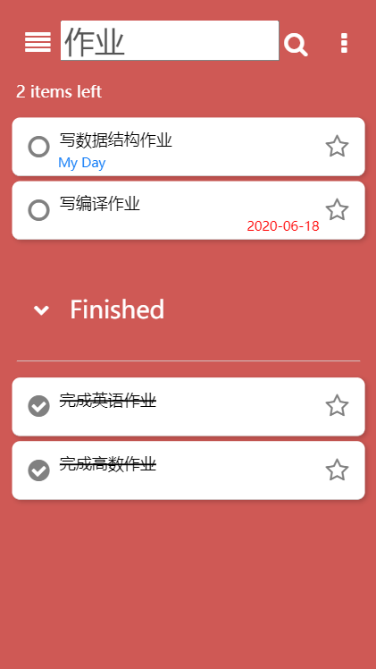

点击侧边栏的搜索框，则会切换到如上页面，header从普通列表的h2元素换为了搜索输入框，如上为我们搜索作业的结果，在搜索页面会将新建按钮隐藏。

## 亮点总结

高级功能有：

- 可添加“我的一天”
- 可添加截止日期
- 可设置星标置顶
- 在同一页面显示已完成列表，并可设置开启隐藏

- 编辑单条任务
- 排序（截止日期和创建日期）
- 手势排序
- 手势删除
- 侧边栏菜单
- 可切换七种主题
- 切换不同列表，且可在当前列表添加任务
- 搜索功能


# 代码简介

一些实现在介绍功能时已经简单提及，这里再通过update函数即可窥见项目的大概框架：

```js
	document.body.style.backgroundColor = model.data.theme;
	if (data.filter == "Important") {
		items = data.items.filter(function (task) {
			return task.starred;
		});
	} else if (data.filter == "Planned") {
		items = data.items.filter(function (task) {
			return task.deadline != "";
		});
	} else if (data.filter == "Finished") {
		items = data.items.filter(function (task) {
			return task.finished;
		});
	} else if(data.filter == "My Day") {
		items = data.items.filter(function (task) {
			return task.myDay;
		});
	} else if(data.filter == "Search") {
		items = data.items.filter(function (task) {
			return task.msg.search($("#search-input").value) != -1;
		});
	}
	//按照priority排序，大的在前边
	items.sort(function (x, y) {
		if (x.priority < y.priority) {
			return 1;
		}
		if (x.priority > y.priority) {
			return -1;
		}
		return 0;
	});

	//显示当前类别剩下的
	items.forEach(function (item) {
		if (!item.finished) ++activeCount;
	});
	$("#count").innerHTML = activeCount + " items left";
	items
		.filter(function (task) {
			return !task.finished;
		})
		.forEach(function (task) {
			taskList.append(createListItem(task));
		});
	items
		.filter(function (task) {
			return task.finished;
		})
		.forEach(function (task) {
			finishedTaskList.append(createListItem(task));
		});
}
```

首先会判断当前的filter是什么，侧边栏点击不同的列表时，会改变model.data.filter，筛选出对应的项后，再根据任务的priority进行排序，任务的priority会在手势排序，下拉菜单排序时改变。最后将任务分别添加到两个list：已完成和未完成，在一个页面同时展示。
